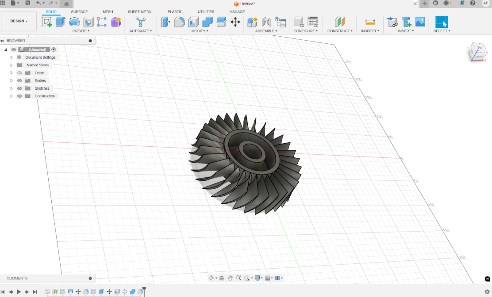
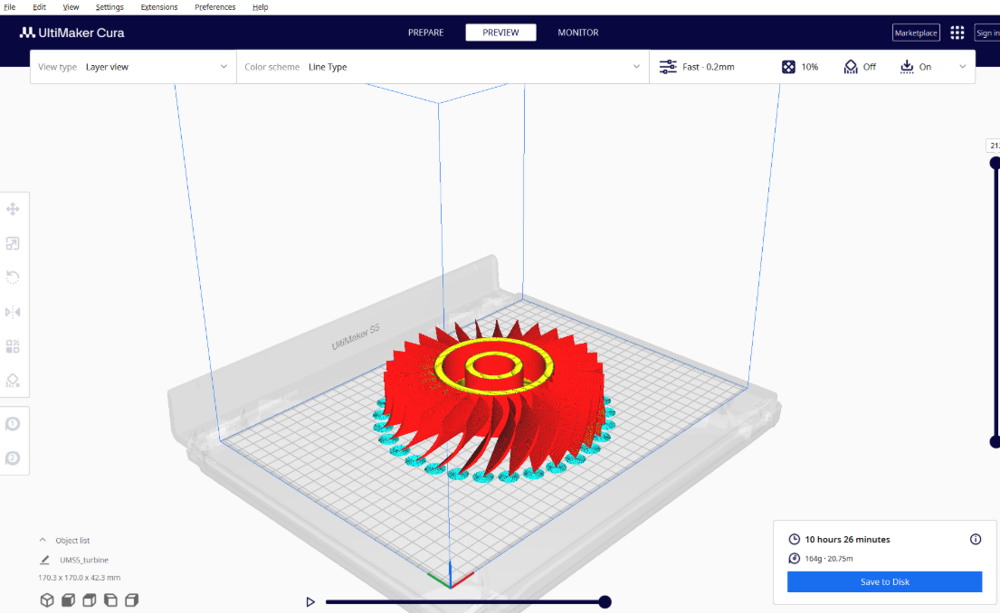

# Ex.   - REVERSE ENGINEER THE GIVEN PRODUCT

### DATE:3.12.2025

## AIM: 
### To reverse engineering the product and prototyping the same in 3D printer.

## REQUIREMENTS:
### ●	CURA 4.0 Software
### ●	 Autodesk Fusion 360
### ●	 System - Windows 7 or higher, 1 GB RAM.

## PROCEDURE:
### Step 1.:- Duplicate all the geometric features for the given object using vernier caliper, measuring tapes or any instruments provided
### Step 2.:- Design the geometric features in 3D using auto desk fusion 360.
### Step 3.:- Save the file and export as .stl
### Step 4.:- Check all Electrical connections in the 3D printer.
### Step 5.:- First we install the software related the 3D printer (idea maker, ultimaker etc.)In idea maker first open the software and click the open file option.
### Step 6.:- Select the Pan option and select the extruder (left or right) for printing the design.
### Step 7.:- Select the Move option for design print position in build tack plate and then after select the Rotate option for rotating the design easily printed and used low print material.
### Step 8.:- select the Scale option for design scale according to build tack plate area and then
### after click the start option and select printing option standard as shown in below figure.
### Step 9.:- After completing the all setting then click the Slice option and export the file in gcode Format.
### Step 10.:- After generate the gcode format then follow the these instruction 
  ###   ●	Switch on the 3d printer.
  ###   ●	Place your Pen drive in USB.
  ###   ●	Clean your surface bed plate.
  ###   ●	Load your filament into the required extruder as per the requirement.
  ###   ●	Wait until the nozzle & bed plate comes into the required temperature.
  ###   ●	Close the doors of the 3d printer.
  ###   ●	Open the file from the USB storage and select the Print option.

## Input:
### Output:

### Name:Yuvasri V
### Register Number:25008890

## RESULT:
###   Thus the given product is reverse engineered and prototyped using 3D Printer.
